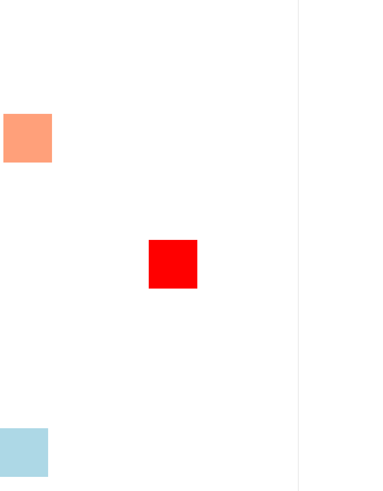

## 前言

技术文章，尤其是前端技术文章具有时效性。

如文中提到的部分内容出现*break change*或出现内容错误（文字错误/错误的理论描述），为尽可能避免对后面的读者造成困扰，如果可以的话，希望在文章的评论区或代码仓库issues中予以指正，十分感谢。

## 摘要

本文主要介绍了一种基于`Web Animations API`实现的**元素斜抛动画**解决方案。

本文相比于其他方案不同的是：为了使代码结构更紧凑，复用更方便，本文没有采取`@keyframes`的方式声明动画，也不需要在`html`部分声明任何标签，而是直接采用`class`类的方式用JS集中处理DOM元素的挂载、样式配置、动画播放。

在使用时只需要：

```js
const moveBall = new MoveBall({startDom, endDom})
moveBall.freeThrow()
```

## 效果预览



## 实现思路

1. 确定起点坐标和终点坐标
2. 根据起止坐标确定斜抛运动的贝塞尔曲线公式
3. 动画播放完后回收DOM元素

## 代码实现（附用例）

```js
// MoveBall.js
class MoveBall {
    constructor({ startDom, endDom }) {
        this.startXy = MoveBall.getCenterCoordinates(startDom);
        this.endXy = MoveBall.getCenterCoordinates(endDom);
        this.verticalDom = MoveBall.cerateVerticalDom(startDom);
        this.horizontalDom = MoveBall.createHorizontalDom();
        this.verticalDom.appendChild(this.horizontalDom);
    }
    static ballW = 30;
    static ballH = 30;
    static getCenterCoordinates(domElement) {
        const rect = domElement.getBoundingClientRect();
        const centerX = rect.left + rect.width / 2;
        const centerY = rect.top + rect.height / 2;
        return { x: centerX, y: centerY };
    }
    static cerateVerticalDom(startDom) {
        const startXy = MoveBall.getCenterCoordinates(startDom);
        const verticalDom = document.createElement('div');
        verticalDom.style.position = 'fixed';
        verticalDom.style.top = `${startXy.y - MoveBall.ballH / 2}px`;
        verticalDom.style.left = `${startXy.x - MoveBall.ballW / 2}px`;
        verticalDom.style.zIndex = '999';
        return verticalDom;
    }
    static createHorizontalDom() {
        const horizontalDom = document.createElement('div');
        horizontalDom.style.width = `${MoveBall.ballW}px`;
        horizontalDom.style.height = `${MoveBall.ballH}px`;
        horizontalDom.style.borderRadius = '50%';
        horizontalDom.style.background = 'lightgreen';
        return horizontalDom;
    }
    getOffsetXy() {
        return {
            x: this.endXy.x - this.startXy.x,
            y: this.endXy.y - this.startXy.y,
        };
    }
    freeThrow() {
        document.body.appendChild(this.verticalDom);
        let verticalEasing =
            this.startXy.y < this.endXy.y ? 'cubic-bezier(.44,-1.43,1,1)' : 'cubic-bezier(0,0,.76,1.92)';
        let verticalAnimate = this.verticalDom.animate(
            [{ transform: `translate3d(0, ${this.getOffsetXy().y}px, 0)` }],
            {
                easing: verticalEasing,
                duration: 800,
                iterations: 1,
            }
        );
        this.horizontalDom.animate([{ transform: `translate3d(${this.getOffsetXy().x}px, 0, 0)` }], {
            easing: 'linear',
            duration: 800,
            iterations: 1,
        });
        verticalAnimate.onfinish = () => {
            this.verticalDom.remove();
        };
    }
}

```

**用例**

```html
<!DOCTYPE html>
<html lang="en">
    <head>
        <meta charset="UTF-8" />
        <meta name="viewport" content="width=device-width, initial-scale=1.0" />
        <title>Document</title>
        <style>
            #d1,
            #d2,
            #d3 {
                width: 100px;
                height: 100px;
            }
            #d1 {
                background: lightsalmon;
                position: fixed;
                top: 30%;
            }
            #d2 {
                background: lightblue;
                position: fixed;
                top: 80%;
                left: 0;
            }
            #d3 {
                background: red;
                position: fixed;
                top: 50%;
                left: 50%;
            }
        </style>
    </head>
    <body>
        <div id="d1"></div>
        <div id="d2"></div>
        <div id="d3"></div>
        <script src="./MoveBall.js"></script>
        <script>
            const d1 = document.getElementById('d1');
            const d2 = document.getElementById('d2');
            const d3 = document.getElementById('d3');
            d1.onclick = function (e) {
                let moveball = new MoveBall({
                    startDom: d1,
                    endDom: d3,
                });
                moveball.freeThrow();
            };
            d2.onclick = function (e) {
                let moveball = new MoveBall({
                    startDom: d2,
                    endDom: d3,
                });
                moveball.freeThrow();
            };
        </script>
    </body>
</html>

```

## 斜抛运动的分解

斜抛运动的效果实际上是由水平运动和垂直运动组合而成的。

在水平方向上，小球做匀速的平移运动。

垂直方向上，小球运动轨迹取决于起点坐标和终点坐标的高低差。

**注意哈，因为`getBoundingClientRect()`返回值是相对于视图窗口的左上角来计算的，所以当返回的y值越大，代表这个元素视觉上处在越低的位置。**

由此我们可以归纳出：

如果起点的纵坐标 **小于** 终点的纵坐标，则起点目标在垂直方向上**高于**终点目标（用例中d1）。此时斜抛运动的轨迹应遵循：先反向远离起点目标再接近终点目标，其贝塞尔曲线为`cubic-bezier(.44,-1.43,1,1)`（via [cubic-bezier(.44,-1.43,1,1) ✿ cubic-bezier.com](https://cubic-bezier.com/#.44,-1.43,1,1)）。（举例：起点纵坐标100，终点纵坐标200，则其纵坐标变化规律类似于：100=>80=>200）

如果起点的纵坐标 **大于** 终点的纵坐标，则起点目标在垂直方向上**低于**终点目标（用例中d2）。此时斜抛运动的轨迹应遵循：达到终点目标后再远离终点目标，然后再次接近终点目标，其贝塞尔曲线为`cubic-bezier(0,0,.76,1.92)`（via [cubic-bezier(0,0,.76,1.92) ✿ cubic-bezier.com](https://cubic-bezier.com/#0,0,.76,1.92)）。（举例：起点纵坐标300，终点纵坐标200，则纵坐标变化规律类似于：300=>200=>180=>200）

## 总结

实现这个效果前，我不是没查阅过用`@keyframes`实现的文章。但是前段时间受`TweenMax` `GSAP `这些动画库的影响，思维形成惯性，会倾向于用JS解决问题。本文代码实现的关键在于`Element.animate()`这个API，掌握了这个API，实现动画效果会从容的多。

## 参考资料·鸣谢

[Deja-vuuu/vue-ele: 🥗🥗 vue教程 --- 从0-1高仿饿了么App (github.com)](https://github.com/Deja-vuuu/vue-ele)

[使用原生Element.animate实现文字与图片动画 - 掘金 (juejin.cn)](https://juejin.cn/post/7037109871208038437)

[Animation - Web API 接口参考 | MDN (mozilla.org)](https://developer.mozilla.org/zh-CN/docs/Web/API/Animation)

[cubic-bezier(.17,.67,.83,.67) ✿ cubic-bezier.com](https://cubic-bezier.com/#.17,.67,.83,.67)
