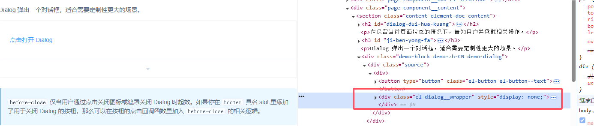

## 前言

技术文章，尤其是前端技术文章具有时效性。

如文中提到的部分内容出现*break change*或出现内容错误（文字错误/错误的理论描述），为尽可能避免对后面的读者造成困扰，如果可以的话，希望予以指正，十分感谢。

## 摘要

本文主要介绍了一种基于`Vue2`的简易弹窗实现和调用模式。

弹窗的实现方案网上特别多，本文主要想表达的是：通过执行方法来拉起弹窗的方式，更符合“高内聚低耦合”的特征。

## 背景

在工作过程中发现，`el-dialog`在复杂场景的使用并不是特别契合开发需求，具体表现为：

1. **冗余的dialogVisible变量**

`el-dialog`通过`:visible.sync="dialogVisible"`来控制弹窗的显示和隐藏。
我们需要在弹窗调用层的`data(){}`中为每一个弹窗声明一个**dialogVisible**，对于页面中十个以上弹窗的场景，其变量的维护简直是灾难。
在大多数场景中我们并不关心也不会特意的去访问弹窗的开闭情况，甚至可以这么说：对于弹窗调用层来说只需要调用`openDialog()`，甚至不需要去关心何时调用`close`。
简而言之：就算我们确实需要一个**dialogVisible**，也尽量不要把它声明在调用层里。

2. **数据通讯和事件通讯让人倍感捉急**

如果我们通过`$emit v-on`的方式进行组件间通讯（虽然Vue官方推荐这么做），会导致代码逻辑分散。
从操作行为上来说，弹窗本质上是主线任务中的一个支线任务，**调用层在多数情况下只关心这个支线任务的结果**，并不关心弹窗里发生了什么。
因此我们可以采用下面这样的代码组织方式，将逻辑完全内聚到调用层的`openDialog`方法中，改善代码可读性。

```js
// 调用层
methods: {
  async openDialog() {
    const initDataFromParent = {}
    const taskResult = await this.$refs.dialog.open(initDataFromParent);
	// do something after you get taskResult from dialog
    // 在这个函数里要特别注意内存泄漏的情况
  },
},
// dialog实现层
methods: {
  open(initDataFromParent) {
    return new Promise((resolve, reject) => {
      this.resolve = resolve;
      this.reject = reject;
    });
  },
  confirm(taskResult) {
    this.resolve(taskResult);
  },
},
```

3. **DOM树结构不理想**

实际上，`el-dialog`的DOM结构的挂载位置有两种，一种是在何处声明就在何处挂载，另一种是通过`append-to-body`挂载到body上。
第一种方式在SSR渲染时会有些问题（首次进入页面时弹窗内容可能会先跳出来再隐藏），并且这种方式简直逼死强迫症，**从整个应用视图的角度来看，弹窗在 DOM 中应该被渲染在其他地方**，甚至在整个 Vue 应用外部。



4. **样式调度问题**

`el-dialog`弹窗默认水平居中，垂直不居中。垂直方向上的间距通过`top`属性设置上外边距控制，如果你想要垂直居中的效果，需要将`top`赋值为0并重写`.el-dialog`类选择器样式。
如果你启动了` append-to-body `，在调整某些元素的样式时，可能需要去掉`scoped`。

## 实现

## 总结

1. `<Teleport>`组件真是好东西，可惜Vue2没有这玩意，啥事都得自己来。
2. 通过`$emit v-on`的传统方式与弹窗组件进行通讯实在是太僵化了，调用层的监听函数一多维护起来好累，能只用一个函数一把过就不要声明多个函数。
3. `el-dialog`的实现大而全，但是简单的功能弹窗也不是非用它不可，小弹窗自己实现反而维护更方便契合。
