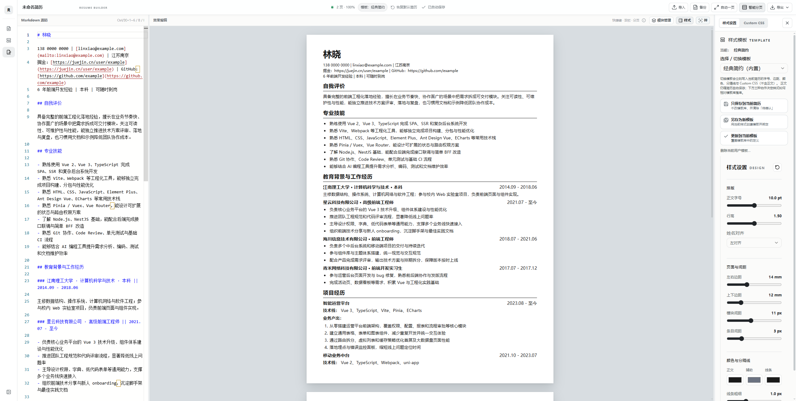
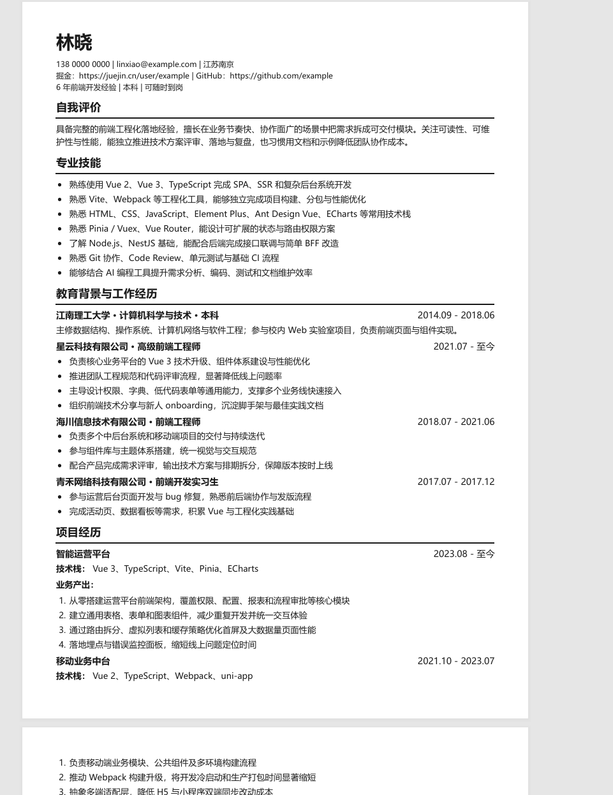

## 前言

all right大伙，长话短说。

之前写简历一直用的wondercv，但是最近几年连导出文件功能都要付费了（挣钱嘛不寒碜），于是vibe了这个简历生成器。

如果你擅长使用`Typora`这类markdown编辑器，**那它非常非常契合你**。

## 链接

[仓库地址](https://github.com/JUST-Limbo/resume-builder)

[在线地址](https://just-limbo.github.io/resume-builder/#/mine)

## 它的特点

+ 怎么用`Typora`就怎么用它，主要快捷键都有，不需要写原始markdown代码，也不搞富文本编辑器那套
+ 很多简历生成器配置多，写得少，这个生成器没有很多配置，更多靠自己写
+ 生成器可以跑在自己电脑上，无需登录账号，简历数据都在本地
+ 能导出矢量PDF而不只是图片转PDF

## 效果预览

**在线编辑：**

**导出效果：**

## 模板太少了怎么办？

1. 自己拉代码vibe就完事儿了
2. 觉得什么模板好，给我留言放个链接，我开写轮眼借鉴 ~~抄~~ 一下

## 最后

祝大家身体健康
